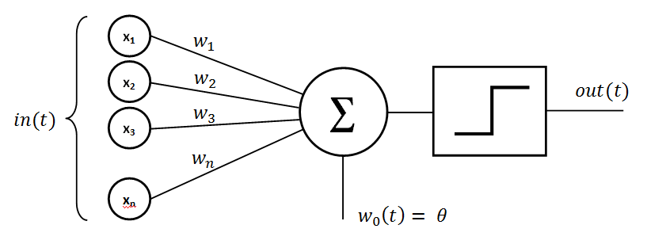
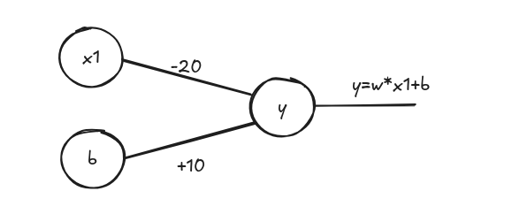
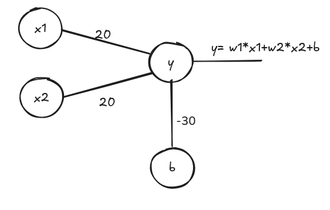
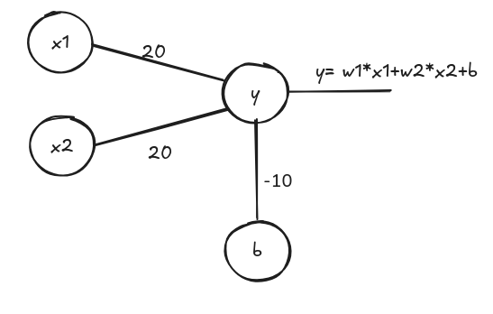
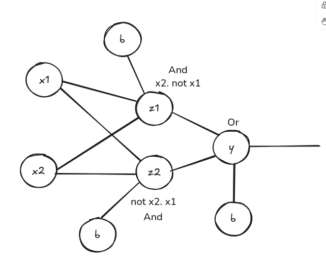

# Deep Learning IIITDMJ Notes
More on this here [Deep_learning_IIITDMJ.ipynb](https://github.com/sudipnext/DiveIntoDeepLearningNotes/blob/main/Deep_learning_IIITDMJ.ipynb)

# Day 1: Setting up the Environment and Introduction to Deep Learning

## Spectral Theories in Mathematics
> It involves breaking down the complex structure into smaller individual components, making them easier to understand.

```bash
[COMPLICATED] = [SIMPLE] + [SIMPLE] + [SIMPLE] + ...
```

### Deep Learning is Simple, Complicated, and Complex at the Same Time

> **Simple**: The basic concepts of deep learning are simple and easy to understand.  
> **Complicated**: Many parts: Deep learning involves many parts that are complicated and difficult to understand.  
> **Complex**: Due to the presence of non-linearities, deep learning is complex and difficult to understand.

## Terms and Objects in Math and Computers

### Linear Algebra Terminology

### Correspondence Between Math and Programming Terminology

| Domain   | Scalar     | Vector         | Matrix                     | Tensor                    |
|----------|------------|----------------|----------------------------|---------------------------|
| Math     | Scalar     | Vector         | Matrix                     | Tensor                    |
| PyTorch  | Float      | Tensor         | Tensor                     | Tensor                    |
| NumPy    | Array      | Array          | 2D Array                   | n-D Array                 |

> **Example**: A grayscale image is a 2D array, an RGB image is a 3D array, and a video is a 4D array (a sequence of images, where each image is a 2D array of pixels).

## Converting Reality into Data
> The process of converting reality into data is called **data collection**. It involves collecting data from various sources, such as sensors, cameras, and other devices, and converting it into a format that can be used for analysis and modeling.

### Two Types of Reality
> 1. **Continuous**  
> 2. **Discrete**

#### Continuous Reality
> 1. Numeric  
> 2. Real Numbers  
> 3. Many Values (Possibility of infinite values)  
> 4. Examples: Temperature, Height, Weight, etc.

#### Discrete Reality
> 1. Numeric  
> 2. Integer Numbers  
> 3. Few Values (Possibility of finite values)  
> 4. Examples: Number of students in a class, Number of cars in a parking lot, etc.

## Representing Categorical Data
> Categorical data can be represented using various techniques, including:  
> 1. **One-Hot Encoding**  
> 2. **Label Encoding**  
> 3. **Binary Encoding**

### One-Hot Encoding
> 1. 0 or 1 per category  
> 2. Each category is represented by a binary vector  
> 3. Example: If we have three categories: Red, Green, and Blue, then the one-hot encoding would be:  

```plaintext
Red: [1, 0, 0]
Green: [0, 1, 0]
Blue: [0, 0, 1]
```

| Genre | Action | Comedy | Drama |
|-------|--------|--------|-------|
| M1    | 1      | 0      | 0     |
| M2    | 0      | 1      | 0     |
| M3    | 0      | 0      | 1     |

> 4. Creates a sparse matrix.

### Label Encoding
> 1. Assigns a unique integer to each category.  
> 2. Example: If we have three categories: Red, Green, and Blue, then the label encoding would be:  

```plaintext
Red: 0
Green: 1
Blue: 2
```

### Binary Encoding
> 1. Converts the integer labels into binary format.  
> 2. Example: If we have three categories: Red, Green, and Blue, then the binary encoding would be:  

```plaintext
Red: 00
Green: 01
Blue: 10
```

## Vector and Matrix Transpose
> 1. **Transpose of a vector**: Converts a row vector into a column vector and vice versa.  
> 2. **Transpose of a matrix**: Flips the matrix over its diagonal, converting rows into columns and columns into rows.  

```plaintext
       T
[a b c]
```

Transpose:
```plaintext
[a]
[b]
[c]
```

## Dot Product
> The dot product is a mathematical operation that takes two equal-length sequences of numbers (usually coordinate vectors) and returns a single number. It is calculated by multiplying corresponding entries and summing those products.  

```plaintext
[a₁, a₂, a₃] ⋅ [b₁, b₂, b₃] = a₁b₁ + a₂b₂ + a₃b₃
```

## SoftMax Function
> The SoftMax function is a mathematical function that converts a vector of numbers into a probability distribution. It is often used in the output layer of a neural network for multi-class classification problems.  

$$
\text{SoftMax}(x) = \left[\frac{e^{z_i}}{\sum e^{z_i}} \text{ for } i \in \text{range(len(z))}\right]
$$

> SoftMax outputs values in the range [0, 1], where the sum of all outputs equals 1. This makes it suitable for multi-class classification problems, where each output represents the probability of a particular class.

## Logarithms
> Log is the inverse of the natural exponential function.  
> Log is a monotonic function, meaning it is always increasing.  
> This is important because minimizing \(x\) is the same as minimizing \(\log(x)\) (only for \(x > 0\)).  
> Log stretches small input values and compresses large input values.


> The above graph shows the logarithmic function, which is a monotonic function that is always increasing. The logarithm of a number is the exponent to which the base must be raised to produce that number. For example, log base 10 of 100 is 2, because \(10^2 = 100\).

## Exponential Function
> The exponential function is a mathematical function that grows rapidly as the input increases. It is defined as:  

$$
\text{exp}(x) = e^x
$$


## Entropy
> Entropy is the measure of randomness or uncertainty in a system. In the context of information theory, it quantifies the amount of uncertainty in a random variable. The entropy of a discrete random variable \(X\) is defined as:  

$$
H(X) = -\sum p(x) \cdot \log(p(x)) \quad \text{for all } x \in X
$$

Where:  
- \(p(x)\) is the probability of \(x\) occurring.  
- \(x\) = data values  

> High entropy means lots of variability in the data, while low entropy means less variability in the data.  
> Low entropy means most of the values in the datasets repeat.  
> Entropy is nonlinear and makes no assumptions about the distribution of the data.

## Cross Entropy
> Cross-entropy is a measure of the difference between two probability distributions. It is often used in machine learning to quantify the difference between the predicted probability distribution and the true probability distribution. The cross-entropy between two probability distributions \(P\) and \(Q\) is defined as:  

$$
H(P, Q) = -\sum p(x) \cdot \log(q(x)) \quad \text{for all } x \in X
$$

Where:  
- \(p(x)\) is the true probability distribution,  
- \(q(x)\) is the predicted probability distribution.  

> It describes the relationship between the two probability distributions.

# Day 2: Mathematics for Deep Learning and Neural Network Basics

## Perceptron: A Linear Classifier
> A perceptron is a simple linear classifier that maps input features to output classes. It consists of a set of weights and a bias term, which are used to compute a weighted sum of the input features. The output is then passed through an activation function to produce the final prediction.

## Rosenblatt's Perceptron
> The perceptron was introduced by Frank Rosenblatt in 1958. It is a simple model that can be used to classify linearly separable data. The perceptron learns the weights and bias by minimizing the error between the predicted output and the true output.  

  
Image source: [Rosenblatt's Perceptron](https://www.google.com/url?sa=i&url=https%3A%2F%2Fmedium.com%2F%40aaronbrennan.brennan%2Fthe-perceptrons-beginning-rosenblatt-and-minsky-papert-1813def0817b&psig=AOvVaw0xmcABfuPQW-oZ-dJ-VuX4&ust=1749224390595000&source=images&cd=vfe&opi=89978449&ved=0CBgQjhxqFwoTCNil_eTO2o0DFQAAAAAdAAAAABAL)

> The output of a perceptron can be represented as:  

$$
\text{output} = \text{activation\_function}(w_1 \cdot x_1 + w_2 \cdot x_2 + \dots + w_n \cdot x_n + b)
$$

Where:  
- \(w_1, w_2, \dots, w_n\) are the weights,  
- \(x_1, x_2, \dots, x_n\) are the input features,  
- \(b\) is the bias term,  
- \(\text{activation\_function}\) is a non-linear function that introduces non-linearity into the model.

## The XOR Problem
> The XOR problem is a classic example of a problem that cannot be solved by a single-layer perceptron. It is a non-linearly separable problem, meaning that it cannot be separated by a straight line in the input space. The XOR function takes two binary inputs and produces a binary output, where the output is true if the inputs are different and false if they are the same.  

```plaintext
XOR Truth Table:
| Input 1 | Input 2 | Output |
|----------|----------|--------|
|    0     |    0     |   0    |
|    0     |    1     |   1    |
|    1     |    0     |   1    |
|    1     |    1     |   0    |
```

> Rosenblatt's perceptron was criticized by Minsky and Papert in 1969 for not being able to solve the XOR problem. They showed that a single-layer perceptron cannot learn the XOR function, which led to a temporary decline in interest in neural networks.  

> Rosenblatt's perceptron proved that neural networks can learn by preparing an electrical model that can classify the digits 0-9 for a mail sorting machine.

### Perceptron Learning Algorithm | Criteria for Convergence
```plaintext
1. Initialize weights and bias to small random values.
2. For each training example (x, y):
   a. Compute the output: 
      output = activation_function(w1*x1 + w2*x2 + ... + wn*xn + b)
   b. Update weights and bias:
      w_i = w_i + learning_rate * (y - output) * x_i
      b = b + learning_rate * (y - output)
3. Repeat steps 2 until convergence (i.e., when the weights and bias do not change significantly).
      w_i = w_i + learning_rate * (y - output) * x_i
      b = b + learning_rate * (y - output)
3. Repeat steps 2 until convergence (i.e., when the weights and bias do not change significantly).
```

## Iterative Weight Update Rule by Learning

### Cauchy's Rule [1849]
> Cauchy's rule is an iterative method for finding the roots of a function. It is used to update the weights and bias in the perceptron learning algorithm. The rule states that the weights and bias should be updated in the direction of the negative gradient of the error function.  

```math
W^{(t+1)} = W^{(t)} - \eta \cdot \nabla E
```

```math
\text{Where:}  

W^{(t+1)} \text{ is the updated weight vector,}  
W^{(t)} \text{ is the current weight vector,}  
\eta \text{ is the learning rate (a small positive constant controlling the step size),}  
\nabla E \text{ is the gradient of the error function with respect to the weights.}  
```
#### Slope of the Error Function
> The slope of the error function is the gradient of the error function with respect to the weights. It indicates the direction in which the weights should be updated to minimize the error. The gradient is computed as:  

```math
\nabla E = \left[\frac{\partial E}{\partial w_1}, \frac{\partial E}{\partial w_2}, \ldots, \frac{\partial E}{\partial w_n}\right]
```
> Where:
- \( \frac{\partial E}{\partial w_i} \) is the partial derivative of the error function with respect to the weight \( w_i \).

> The gradient points in the direction of the steepest increase of the error function, so we update the weights in the opposite direction to minimize the error.

```math
W^{(t+1)} = W^{(t)} - \eta \cdot \nabla E
```

> Smaller \( \eta \) means slower convergence, while larger \( \eta \) means faster convergence but can lead to overshooting the minimum.

> -ve sign is because we want to minimize the error function, so we move in the direction of the negative gradient.

## Multi Layer Perceptron (MLP)
> A Multi-Layer Perceptron (MLP) is a type of neural network that consists of multiple layers of neurons, including an input layer, one or more hidden layers, and an output layer. Each neuron in a layer is connected to every neuron in the next layer, forming a fully connected network.


Image Reference[Datacamp](https://www.datacamp.com/tutorial/multilayer-perceptrons-in-machine-learning)

## Output of a Multi-Layer Perceptron
> The output of a Multi-Layer Perceptron is computed by passing the input through each layer, applying an activation function at each neuron, and finally producing the output at the output layer. The output can be represented as:
```math
\text{output} = \text{activation\_function}(W^{(L)} \cdot \text{activation\_function}(W^{(L-1)} \cdot \ldots \cdot \text{activation\_function}(W^{(1)} \cdot x + b^{(1)}) + b^{(2)}) + \ldots + b^{(L)})
```

Where:
-  W^(i) is the weight matrix for layer i ,
- b^(i) is the bias vector for layer i ,
- activation_function is a non-linear activation function applied at each layer,
- L is the number of layers in the MLP,
- x is the input vector.

## Activation Functions
> Activation functions introduce non-linearity into the model, allowing the MLP to learn complex relationships in the data. Common activation functions include:
### Sigmoid Function
> The sigmoid function is a smooth, S-shaped curve that maps any real-valued number to the range [0, 1]. It is defined as:
```math
\sigma(x) = \frac{1}{1 + e^{-x}}
```
> The sigmoid function is often used in the output layer of binary classification problems, as it produces a probability-like output.

### Hyperbolic Tangent Function (tanh)
> The hyperbolic tangent function is similar to the sigmoid function but maps the input to the range [-1, 1]. It is defined as:
```math
\tanh(x) = \frac{e^x - e^{-x}}{e^x + e^{-x}}
```
> The tanh function is often used in hidden layers of MLPs, as it has a zero-centered output, which can help with convergence during training.

### Rectified Linear Unit (ReLU)
> The Rectified Linear Unit (ReLU) is a piecewise linear function that outputs the input directly if it is positive; otherwise, it outputs zero. It is defined as:
```math
\text{ReLU}(x) = \max(0, x)
```
> ReLU is widely used in hidden layers of MLPs due to its simplicity and effectiveness in mitigating the vanishing gradient problem.

### Leaky ReLU
> The Leaky ReLU is a variant of the ReLU that allows a small, non-zero gradient when the input is negative. It is defined as:
```math
\text{Leaky ReLU}(x) = \begin{cases}
x & \text{if } x > 0 \\
\alpha x & \text{if } x \leq 0
\end{cases}
```
> Where \( \alpha \) is a small positive constant (e.g., 0.01). Leaky ReLU helps to prevent dead neurons during training.

### Softmax Function
> The Softmax function is used in the output layer of multi-class classification problems. It converts the raw output scores into probabilities that sum to 1. It is defined as:
```math
\text{Softmax}(z_i) = \frac{e^{z_i}}{\sum_{j=1}^{K} e^{z_j}} \quad \text{for } i = 1, 2, \ldots, K
```
> Where \( K \) is the number of classes, and \( z_i \) is the raw output score for class \( i \). The Softmax function ensures that the output probabilities are non-negative and sum to 1.

### Swish Function
> The Swish function is a smooth, non-monotonic activation function that has been shown to perform well in deep neural networks. It is defined as:
```math
\text{Swish}(x) = x \cdot \sigma(x) = x \cdot \frac{1}{1 + e^{-x}}
```
> The Swish function is differentiable and has a non-zero gradient for all input values, which can help with convergence during training.
### Mish Function
> The Mish function is a smooth, non-monotonic activation function that has been shown to perform well in deep neural networks. It is defined as:
```math
\text{Mish}(x) = x \cdot \tanh(\text{Softplus}(x)) = x \cdot \tanh(\log(1 + e^x))
```
> The Mish function is differentiable and has a non-zero gradient for all input values, which can help with convergence during training.    

### Choice of Activation Function
> The choice of activation function depends on the specific problem and the architecture of the neural network.
> - For binary classification problems, the sigmoid function is often used in the output layer.
> - For multi-class classification problems, the Softmax function is commonly used in the output layer.
> - For hidden layers, ReLU and its variants (Leaky ReLU, Parametric ReLU, etc.) are widely used due to their simplicity and effectiveness in mitigating the vanishing gradient problem.

> Sigmoid can cause vanishing gradients, especially in deep networks, leading to slow convergence during training.
> Tanh is zero-centered, which can help with convergence, but it can still suffer from vanishing gradients in deep networks.
> ReLU is computationally efficient and helps mitigate the vanishing gradient problem, but it can suffer from dead neurons (neurons that never activate).

### Relating Sigmoid and Hyperbolic Tangent Functions: A Mathematical Derivation

The relationship between the sigmoid function and the hyperbolic tangent function is a fundamental concept in neural network theory. This derivation shows how the hyperbolic tangent can be expressed in terms of the sigmoid function.

Let's start with the observation that the hyperbolic tangent function can be derived from the sigmoid function through a simple transformation:

```math
2\sigma(a) - 1 = \tanh(a/2)
```

#### Mathematical Derivation

Beginning with the left side of the equation:

```math
2\sigma(a) - 1 = 2\left(\frac{1}{1 + e^{-a}}\right) - 1
```

```math
= \frac{2}{1 + e^{-a}} - 1
```

```math
= \frac{2}{1 + e^{-a}} - \frac{1 + e^{-a}}{1 + e^{-a}}
```

```math
= \frac{2 - 1 - e^{-a}}{1 + e^{-a}}
```

```math
= \frac{1 - e^{-a}}{1 + e^{-a}}
```

Now, to obtain the hyperbolic tangent form, we multiply both numerator and denominator by $e^{a/2}$:

```math
\frac{1 - e^{-a}}{1 + e^{-a}} = \frac{e^{a/2} - e^{-a/2}}{e^{a/2} + e^{-a/2}} = \tanh(a/2)
```

This elegant relationship shows that scaling and shifting the sigmoid function yields the hyperbolic tangent function. This connection explains why both functions are commonly used as activation functions in neural networks, with tanh providing a zero-centered output in the range [-1, 1], while sigmoid produces outputs in the range [0, 1].

## Solving the XOR Problem with Multi-Layer Perceptron

### XOR-1 Feature X'Formation | Kernel Trick
> The XOR problem can be solved using a Multi-Layer Perceptron (MLP) by transforming the input features into a higher-dimensional space. This transformation allows the MLP to learn non-linear decision boundaries that can separate the classes in the XOR problem.

| x2 | x1 | x3 = x1 * x2 | x1 xor x2 |
|----|----|--------------|-----------|
|  0 |  0 |      0       |     0     |
|  0 |  1 |      0       |     1     |
|  1 |  0 |      0       |     1     |
|  1 |  1 |      1       |     0     |

### XOR-2 from basic Logic Gates
> The 3 gates `AND`, `OR`, `NOT` can be used to make any complex gates. To make a XOR Gate we have XOR as

x2 xor x1 = (x2 and not x1) or (not x2 and x1)

Now for this we need to first make a Not Gate

### NOT GATE



Let's make a truth table for the Not Gate to verify the output

x1 | not x1
|----|--------|
|  0 |   1    |   
|  1 |   0    |

So, When we use the above values like weight -20 as w and the bias as +10 then we got the output as when 

>case, x1=0

```math
y = w * x1 + b = -20 * 0 + 10 = 10
```

If we pass it through some activation function like sigmoid then we get the output as


```math
\text{output} = \sigma(y) = \frac{1}{1 + e^{-y}} = \frac{1}{1 + e^{-10}} \approx 1
```


>case, x1=1

```math
y = w * x1 + b = -20 * 1 + 10 = -10
```

If we pass it through some activation function like sigmoid then we get the output as


```math
\text{output} = \sigma(y) = \frac{1}{1 + e^{-y}} = \frac{1}{1 + e^{10}} \approx 0
```

### AND GATE

Let's make a truth table for the AND Gate to verify the output
x1 | x2 | x1 and x2
|----|----|-----------|
|  0 |  0 |     0     | 
|  0 |  1 |     0     |
|  1 |  0 |     0     |
|  1 |  1 |     1     |

So if we use the x1 weight i.e w1 =20 and x2 weight i.e w2 = 20 and bias as -30 then we got the output as when
>case, x1=0, x2=0

```math
y = w1 * x1 + w2 * x2 + b = 20 * 0 + 20 * 0 - 30 = -30
```
Passing through Sigmoid
```math
\text{output} = \sigma(y) = \frac{1}{1 + e^{-y}} = \frac{1}{1 + e^{30}} \approx 0
```
>case, x1=0, x2=1

```math
y = w1 * x1 + w2 * x2 + b = 20 * 0 + 20 * 1 - 30 = -10
```
Passing through Sigmoid

```math
\text{output} = \sigma(y) = \frac{1}{1 + e^{-y}} = \frac{1}{1 + e^{10}} \approx 0
```
>case, x1=1, x2=0

```math
y = w1 * x1 + w2 * x2 + b = 20 * 1 + 20 * 0 - 30 = -10
```   
Passing through Sigmoid

```math
\text{output} = \sigma(y) = \frac{1}{1 + e^{-y}} = \frac{1}{1 + e^{10}} \approx 0
```
>case, x1=1, x2=1

```math
y = w1 * x1 + w2 * x2 + b = 20 * 1 + 20 * 1 - 30 = 10
```
Passing through Sigmoid

```math
\text{output} = \sigma(y) = \frac{1}{1 + e^{-y}} = \frac{1}{1 + e^{-10}} \approx 1
```

### OR GATE

Let's make a truth table for the OR Gate to verify the output
x1 | x2 | x1 or x2
|----|----|----------|
|  0 |  0 |    0     |
|  0 |  1 |    1     |
|  1 |  0 |    1     |
|  1 |  1 |    1     |

So if we use the x1 weight i.e w1 =20 and x2 weight i.e w2 = 20 and bias as -10 then we got the output as when

>case, x1=0, x2=0

```math
y = w1 * x1 + w2 * x2 + b = 20 * 0 + 20 * 0 - 10 = -10
```
Passing through Sigmoid

```math
\text{output} = \sigma(y) = \frac{1}{1 + e^{-y}} = \frac{1}{1 + e^{10}} \approx 0
```
>case, x1=0, x2=1

```math
y = w1 * x1 + w2 * x2 + b = 20 * 0 + 20 * 1 - 10 = 10
```
Passing through Sigmoid

```math
\text{output} = \sigma(y) = \frac{1}{1 + e^{-y}} = \frac{1}{1 + e^{-10}} \approx 1
```
>case, x1=1, x2=0

```math
y = w1 * x1 + w2 * x2 + b = 20 * 1 + 20 * 0 - 10 = 10
```
Passing through Sigmoid

```math
\text{output} = \sigma(y) = \frac{1}{1 + e^{-y}} = \frac{1}{1 + e^{-10}} \approx 1
```
>case, x1=1, x2=1

```math
y = w1 * x1 + w2 * x2 + b = 20 * 1 + 20 * 1 - 10 = 30
```
Passing through Sigmoid

```math 
\text{output} = \sigma(y) = \frac{1}{1 + e^{-y}} = \frac{1}{1 + e^{-30}} \approx 1
```

### Reconstructing the Whole neural Network Now



We can initialize the weights and biases as follows:

w1 = 20, w2 = 20, w3 = -30, w4 = 20, w5 = 20, b1 = -10, b2 = -10, b3 = -30

XOR Truth Table with Weights and Biases
| x1 | x2 | z1 = x1 AND NOT x2 | z2 = NOT x1 AND x2 | y = z1 OR z2 |
|----|----|--------------------|-------------------|-------------|
|  0 |  0 |         0          |         0         |      0      |
|  0 |  1 |         0          |         1         |      1      |
|  1 |  0 |         1          |         0         |      1      |
|  1 |  1 |         0          |         0         |      0      |

## Factorization: Probability | Differential Calculus

### The Bayes Rule is Symmetrical
> The Bayes rule is symmetrical, meaning that the order of the conditional probabilities does not matter. It can be expressed as:

```math
P(A|B) * P(B) = P(B|A) * P(A)
```

Where:
- \( P(A|B) \) is the conditional probability of event \( A \) given event \( B \),
- \( P(B|A) \) is the conditional probability of event \( B \) given event \( A \),
- \( P(A) \) is the prior probability of event \( A \),
- \( P(B) \) is the prior probability of event \( B \).

From the Bayes rule, we can derive the following relationship:

```math
P(A|B) = \frac{P(B|A) * P(A)}{P(B)}
```
Where P(A) is the initial or prior probability of event A,
P(A/B) is the updated or Posterior probability of event A given event B,

### The Taylor Series
> The Taylor series is a mathematical representation of a function as an infinite sum of terms, calculated from the values of its derivatives at a single point. It is used to approximate functions that are difficult to compute directly. The Taylor series for a function \( f(x) \) around a point \( a \) is given by:

```math
f(x) = f(a) + f'(a)(x - a) + \frac{f''(a)}{2!}(x - a)^2 + \frac{f'''(a)}{3!}(x - a)^3 + \ldots
```

Where:
- \( f(a) \) is the value of the function at point \( a \),
- \( f'(a) \) is the first derivative of the function at point \( a \),
- \( f''(a) \) is the second derivative of the function at point \( a \),
- \( f'''(a) \) is the third derivative of the function at point \( a \),
- \( n! \) is the factorial of \( n \).

### Jacobian Matrix
> The Jacobian matrix is a matrix of all first-order partial derivatives of a vector-valued function. It describes how the function changes with respect to its inputs. 

```math
J(f) = \begin{bmatrix}
\frac{\partial f_1}{\partial x_1} & \frac{\partial f_1}{\partial x_2} & \ldots & \frac{\partial f_1}{\partial x_n} \\
\frac{\partial f_2}{\partial x_1} & \frac{\partial f_2}{\partial x_2} & \ldots & \frac{\partial f_2}{\partial x_n} \\
\vdots & \vdots & \ddots & \vdots \\
\frac{\partial f_m}{\partial x_1} & \frac{\partial f_m}{\partial x_2} & \ldots & \frac{\partial f_m}{\partial x_n}
\end{bmatrix}
```

Where:
- \( f_i \) is the \( i \)-th component of the function \( f \),
- \( x_j \) is the \( j \)-th input variable.

> Physical Significance:
> The Jacobian matrix is used to analyze the stability and behavior of dynamical systems. It provides information about how small changes in the inputs affect the outputs of the system. The eigenvalues of the Jacobian matrix can be used to determine the stability of equilibrium points in the system.

### Difference Equation
> A difference equation is a mathematical equation that relates a function with its discrete values at different points. It is used to model systems that change over time in discrete steps. The general form of a difference equation is:

```math
f(n) = a_1 f(n-1) + a_2 f(n-2) + \ldots + a_k f(n-k) + b_0 + b_1 g(n-1) + b_2 g(n-2) + \ldots + b_m g(n-m)
```

Where:
- f(n) is the value of the function at step n,
- a_1, a_2, a_k are coefficients for the previous values of the function,
- b_0, b_1, \ldots, b_m are coefficients for the input function g(n) ,
- g(n) is an input function that affects the system at step n.

### The Chain Rule
> The chain rule is a fundamental concept in calculus that describes how to compute the derivative of a composite function. If you have two functions \( f \) and \( g \), the chain rule states that:

```math
\frac{d}{dx} f(g(x)) = f'(g(x)) \cdot g'(x)
```

Where:
- f(g(x)) is the derivative of  f  evaluated at g(x) ,
- g'(x) is the derivative of  g with respect to x .

## BackPropagation
> Backpropagation is an algorithm used to train neural networks by minimizing the error between the predicted output and the true output. It involves computing the gradient of the loss function with respect to the weights and biases of the network, and then updating the weights and biases using gradient descent.
### Backpropagation Algorithm
```plaintext
1. Initialize weights and biases to small random values.
2. For each training example (x, y):
   a. Forward pass:
      i. Compute the output of the network using the current weights and biases.
      ii. Calculate the loss (error) between the predicted output and the true output.
   b. Backward pass:
      i. Compute the gradient of the loss with respect to the output layer.
      ii. Propagate the gradient backward through the network to compute gradients for all layers.
   c. Update weights and biases:
      i. Use the computed gradients to update the weights and biases using gradient descent.
3. Repeat steps 2 until convergence (i.e., when the weights and biases do not change significantly).
```
### Backpropagation Example
```plaintext
1. Initialize weights and biases:
   w1 = 0.5, w2 = -0.5, b = 0.1
2. Forward pass:
   a. Compute the output:
      output = activation_function(w1 * x1 + w2 * x2 + b)
   b. Calculate the loss:
      loss = (output - y)^2
3. Backward pass:
   a. Compute the gradient of the loss with respect to the output:
      dL/dout = 2 * (output - y) * activation_function_derivative(output)
   b. Propagate the gradient backward through the network to compute gradients for all layers.
   c. Update weights and biases:
      i. Use the computed gradients to update the weights and biases using gradient descent.
   w1 = w1 - learning_rate * dL/dw1
   w2 = w2 - learning_rate * dL/dw2
   b = b - learning_rate * dL/db
4. Repeat steps 2 until convergence.
```

## Day2 Python For Deep Learning

### min, max, argmin, argmax
Let's understand the concepts of `min`, `max`, `argmin`, and `argmax` using Python.

```python
import numpy as np
# Create a sample array
arr = np.array([3, 1, 4, 1, 5, 9, 2, 6, 5])
# Find the minimum value
min_value = np.min(arr)
# Find the maximum value
max_value = np.max(arr)
# Find the index of the minimum value
argmin_index = np.argmin(arr)
# Find the index of the maximum value
argmax_index = np.argmax(arr)
# Print the results
print("Minimum value:", min_value)
print("Maximum value:", max_value)
print("Index of minimum value:", argmin_index)
print("Index of maximum value:", argmax_index)

```
#### Output:
```plaintext
Minimum value: 1
Maximum value: 9
Index of minimum value: 1
Index of maximum value: 5

```
Formulae of Argmin and Argmax

```math
z = \underset{x}{\operatorname{arg}}  min f(x)
```

```math
w = \underset{x}{\operatorname{arg}}  max f(x)
```
### Application of Argmin and Argmax in Deep Learning
> Let's say we have a task in NN to classify the image of a sign board into one of the classes: `STOP`, `GO`, `YIELD`. The output layer of the neural network will have three neurons, each representing one of these classes. The output of the network will be a vector of probabilities for each class.

```python
import numpy as np

# Sample output probabilities from the neural network
output_probs = np.array([0.7, 0.2, 0.1])

# Find the predicted class using argmax
predicted_class = np.argmax(output_probs)

# Print the predicted class
print("Predicted class:", predicted_class)
```
#### Output:
```plaintext
Predicted class: 0
```
> In this example, the `argmax` function is used to find the index of the maximum value in the output probabilities, which corresponds to the predicted class. In this case, the predicted class is `0`, which could represent the `STOP` sign.

## Mean and Variance

### Mean
> The mean is the average of a set of values. It is calculated by summing all the values and dividing by the number of values. The mean is a measure of central tendency and provides an indication of the typical value in a dataset.

```python
import numpy as np
# Sample data
data = np.array([1, 2, 3, 4, 5])

# Calculate the mean
mean = np.mean(data)

# Print the mean
print("Mean:", mean)
```
#### Output:
```plaintext
Mean: 3.0
```
> Mean gives the central tendency of the data, which is useful for understanding the overall distribution of values.

Formulae
```math
\mu = \frac{1}{N} \sum_{i=1}^{N} x_i
```
Where,
μ is the mean,
N is the number of values,
xi is the i-th value in the dataset.

### Concept of Dispersion
> Dispersion refers to the spread or variability of a set of values. It provides insights into how much the values deviate from the mean. Common measures of dispersion include variance and standard deviation.
### Variance
> Variance is a measure of how much the values in a dataset deviate from the mean. It is calculated by taking the average of the squared differences between each value and the mean. Variance provides an indication of the spread of the data.

Formulae
```math 
\sigma^2 = \frac{1}{1-N} \sum_{i=1}^{N} (x_i - \mu)^2
```
Where:
- σ is the variance,
- N is the number of values,
- x_i is the i-th value in the dataset,
- μ is the mean of the dataset.

