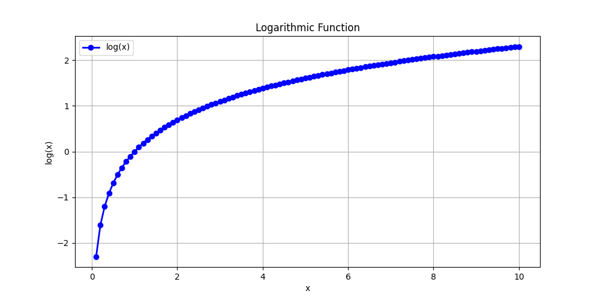
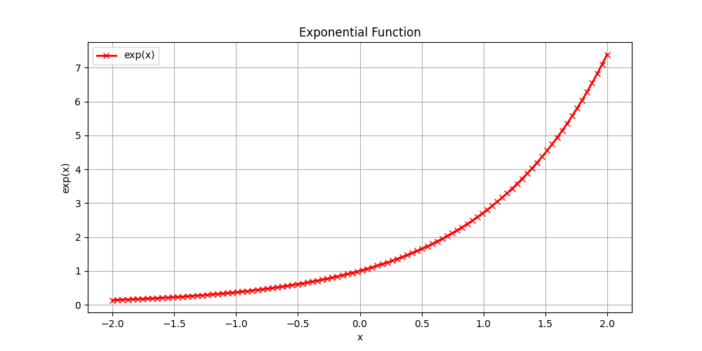

# Day 1: Setting up the Environment and Introduction to Deep Learning

## Spectral Theories in Mathematics
> It involves breaking down the complex structure into smaller individual components, making them easier to understand.

```bash
[COMPLICATED] = [SIMPLE] + [SIMPLE] + [SIMPLE] + ...
```

### Deep Learning is Simple, Complicated, and Complex at the Same Time

> **Simple**: The basic concepts of deep learning are simple and easy to understand.  
> **Complicated**: Many parts: Deep learning involves many parts that are complicated and difficult to understand.  
> **Complex**: Due to the presence of non-linearities, deep learning is complex and difficult to understand.

## Terms and Objects in Math and Computers

### Linear Algebra Terminology

### Correspondence Between Math and Programming Terminology

| Domain   | Scalar     | Vector         | Matrix                     | Tensor                    |
|----------|------------|----------------|----------------------------|---------------------------|
| Math     | Scalar     | Vector         | Matrix                     | Tensor                    |
| PyTorch  | Float      | Tensor         | Tensor                     | Tensor                    |
| NumPy    | Array      | Array          | 2D Array                   | n-D Array                 |

> **Example**: A grayscale image is a 2D array, an RGB image is a 3D array, and a video is a 4D array (a sequence of images, where each image is a 2D array of pixels).

## Converting Reality into Data
> The process of converting reality into data is called **data collection**. It involves collecting data from various sources, such as sensors, cameras, and other devices, and converting it into a format that can be used for analysis and modeling.

### Two Types of Reality
> 1. **Continuous**  
> 2. **Discrete**

#### Continuous Reality
> 1. Numeric  
> 2. Real Numbers  
> 3. Many Values (Possibility of infinite values)  
> 4. Examples: Temperature, Height, Weight, etc.

#### Discrete Reality
> 1. Numeric  
> 2. Integer Numbers  
> 3. Few Values (Possibility of finite values)  
> 4. Examples: Number of students in a class, Number of cars in a parking lot, etc.

## Representing Categorical Data
> Categorical data can be represented using various techniques, including:  
> 1. **One-Hot Encoding**  
> 2. **Label Encoding**  
> 3. **Binary Encoding**

### One-Hot Encoding
> 1. 0 or 1 per category  
> 2. Each category is represented by a binary vector  
> 3. Example: If we have three categories: Red, Green, and Blue, then the one-hot encoding would be:  

```plaintext
Red: [1, 0, 0]
Green: [0, 1, 0]
Blue: [0, 0, 1]
```

| Genre | Action | Comedy | Drama |
|-------|--------|--------|-------|
| M1    | 1      | 0      | 0     |
| M2    | 0      | 1      | 0     |
| M3    | 0      | 0      | 1     |

> 4. Creates a sparse matrix.

### Label Encoding
> 1. Assigns a unique integer to each category.  
> 2. Example: If we have three categories: Red, Green, and Blue, then the label encoding would be:  

```plaintext
Red: 0
Green: 1
Blue: 2
```

### Binary Encoding
> 1. Converts the integer labels into binary format.  
> 2. Example: If we have three categories: Red, Green, and Blue, then the binary encoding would be:  

```plaintext
Red: 00
Green: 01
Blue: 10
```

## Vector and Matrix Transpose
> 1. **Transpose of a vector**: Converts a row vector into a column vector and vice versa.  
> 2. **Transpose of a matrix**: Flips the matrix over its diagonal, converting rows into columns and columns into rows.  

```plaintext
       T
[a b c]
```

Transpose:
```plaintext
[a]
[b]
[c]
```

## Dot Product
> The dot product is a mathematical operation that takes two equal-length sequences of numbers (usually coordinate vectors) and returns a single number. It is calculated by multiplying corresponding entries and summing those products.  

```plaintext
[a₁, a₂, a₃] ⋅ [b₁, b₂, b₃] = a₁b₁ + a₂b₂ + a₃b₃
```

## SoftMax Function
> The SoftMax function is a mathematical function that converts a vector of numbers into a probability distribution. It is often used in the output layer of a neural network for multi-class classification problems.  

$$
\text{SoftMax}(x) = \left[\frac{e^{z_i}}{\sum e^{z_i}} \text{ for } i \in \text{range(len(z))}\right]
$$

> SoftMax outputs values in the range [0, 1], where the sum of all outputs equals 1. This makes it suitable for multi-class classification problems, where each output represents the probability of a particular class.

## Logarithms
> Log is the inverse of the natural exponential function.  
> Log is a monotonic function, meaning it is always increasing.  
> This is important because minimizing \(x\) is the same as minimizing \(\log(x)\) (only for \(x > 0\)).  
> Log stretches small input values and compresses large input values.



> The above graph shows the logarithmic function, which is a monotonic function that is always increasing. The logarithm of a number is the exponent to which the base must be raised to produce that number. For example, log base 10 of 100 is 2, because \(10^2 = 100\).

## Exponential Function
> The exponential function is a mathematical function that grows rapidly as the input increases. It is defined as:  

$$
\text{exp}(x) = e^x
$$



## Entropy
> Entropy is the measure of randomness or uncertainty in a system. In the context of information theory, it quantifies the amount of uncertainty in a random variable. The entropy of a discrete random variable \(X\) is defined as:  

$$
H(X) = -\sum p(x) \cdot \log(p(x)) \quad \text{for all } x \in X
$$

Where:  
- \(p(x)\) is the probability of \(x\) occurring.  
- \(x\) = data values  

> High entropy means lots of variability in the data, while low entropy means less variability in the data.  
> Low entropy means most of the values in the datasets repeat.  
> Entropy is nonlinear and makes no assumptions about the distribution of the data.

## Cross Entropy
> Cross-entropy is a measure of the difference between two probability distributions. It is often used in machine learning to quantify the difference between the predicted probability distribution and the true probability distribution. The cross-entropy between two probability distributions \(P\) and \(Q\) is defined as:  

$$
H(P, Q) = -\sum p(x) \cdot \log(q(x)) \quad \text{for all } x \in X
$$

Where:  
- \(p(x)\) is the true probability distribution,  
- \(q(x)\) is the predicted probability distribution.  

> It describes the relationship between the two probability distributions.
