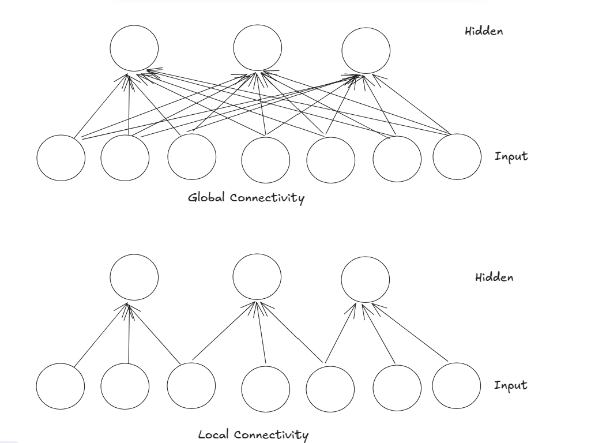

# Day 5 CNN Basics

## Multi Layer Neural Networks with image

The Neural network assumes that it would take any vector as an input not an matrix. So we need to somehow convert the image into the vector. 

One Straightforward way is to stretch the pixels in a vector. But this arises a issue i.e since it's reperesented in a single vector. Suppose if we have image of size `28x28` then it will be stretched to a vector of size `784`. and the dimension would be huge. Then we need to generally consider hidden layer size bigger than the input layer size. if we have 2 layer then we need to do heavy computation cause each of the hidden layer would be doing lot's of computation. So, this is not a good way to represent the image in a vector.

We are loosing the 2d structure of the image. The spatial relationship between pixels is lost when we flatten the image into a vector. This can lead to poor performance in tasks like image classification, where the spatial arrangement of pixels is crucial for understanding the content of the image.

Now we find out that we can't modify the image itself to feed to the neural network. So, can you modify the neural network itself to accept the image as input? Yes, we can do that. This is where Convolutional Neural Networks (CNNs) come into play. 

Two important properties of CNNs are:
1. **Local Connectivity**: CNNs use local connections, meaning that each neuron in a convolutional layer is connected only to a small region of the input image, rather than the entire image. This allows the network to focus on local patterns and features in the image, such as edges, textures, and shapes.

##### Global Connectivity 
- Every Neuron in the input layer is connected to every neuron in the next layer.

inputs = 7
hidden = 3
no_of computations = 3 * 4 = 12

##### Local Connectivity
- Each neuron in the input layer is connected to a small region of the next layer.

inputs = 7
hidden = 3
no_of computations = 3 *3 = 9

2. **Parameter Sharing**: CNNs use shared weights, meaning that the same set of weights is used across different regions of the input image. This reduces the number of parameters in the network, making it more efficient and less prone to overfitting. It also allows the network to learn translation-invariant features, meaning that it can recognize the same feature regardless of its position in the image.
